# 实验九 入侵检测实验
## 实验目的
- 利用snort尝试进行入侵与检测
## 实验环境
- kali
- 受害者主机(ip:172.16.111.101)和攻击者主机(ip:172.16.111.115)
- snort

## 实验步骤
在受害者主机上安装snort
```
禁止在apt安装时弹出交互式配置界面
export DEBIAN_FRONTEND=noninteractive

apt install snort
```
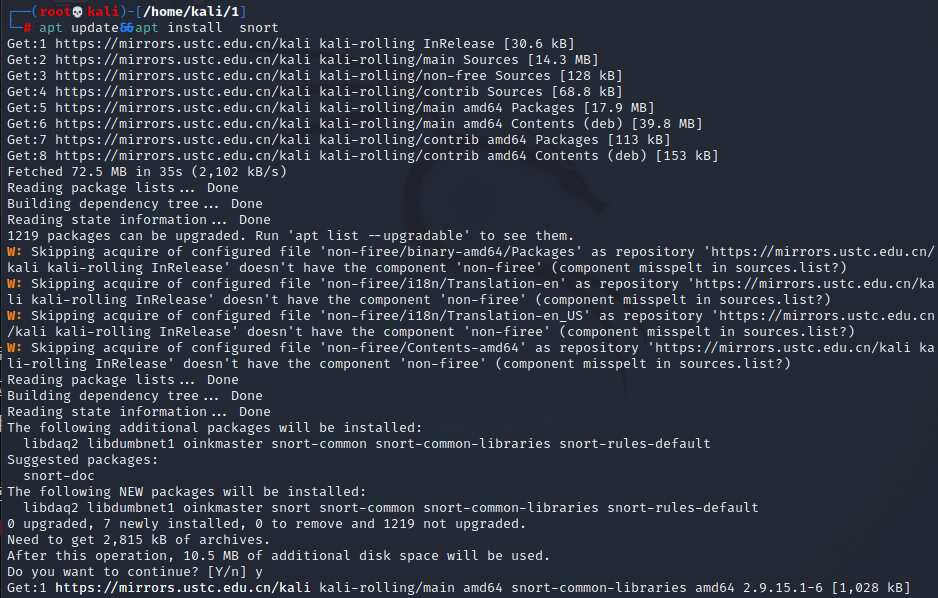

用`cat /etc/snort/snort.debian.conf`查看snort配置文件
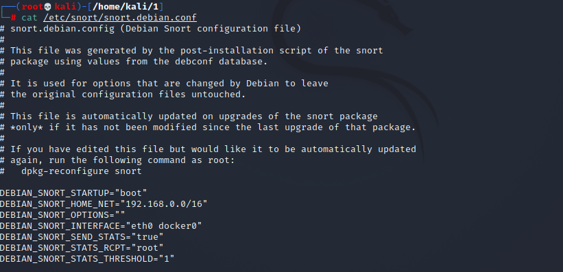

### 实验一：配置snort为嗅探模式
开启测试模式测试snort配置:`snort -T -c /etc/snort/snort.conf`
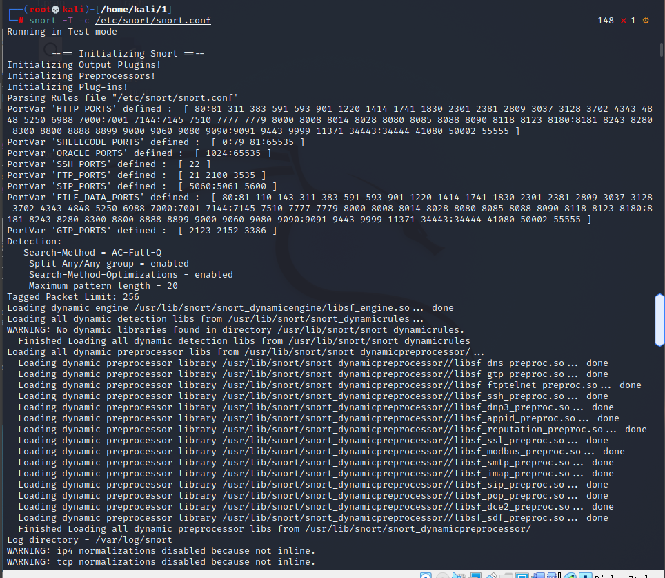

显示IP/TCP/UDP/ICMP头:`snort –v`
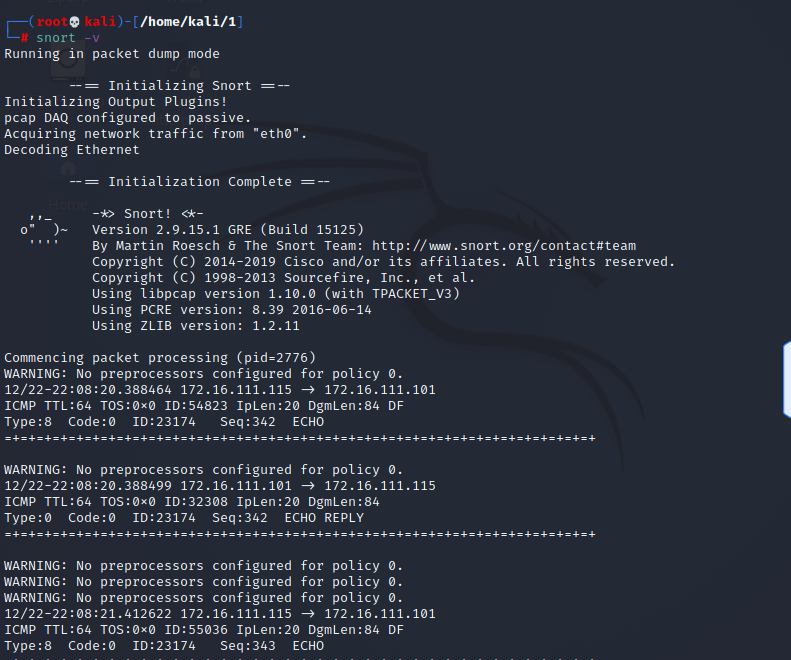

显示应用层数据:`snort -vd`
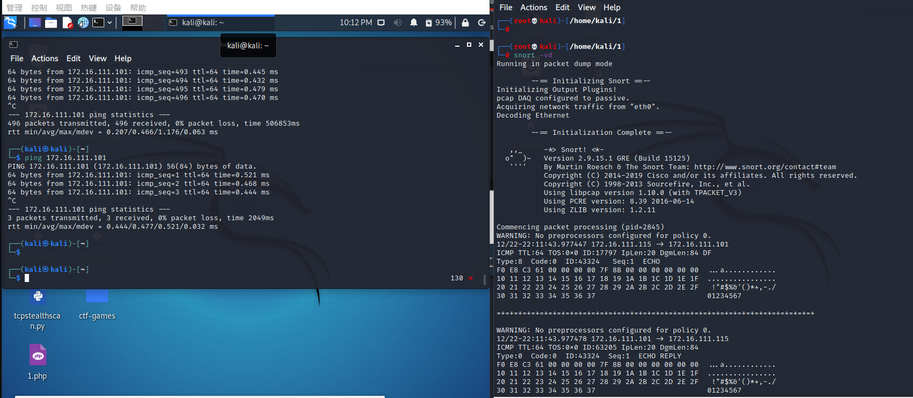

显示数据链路层报文头:`snort -vde`
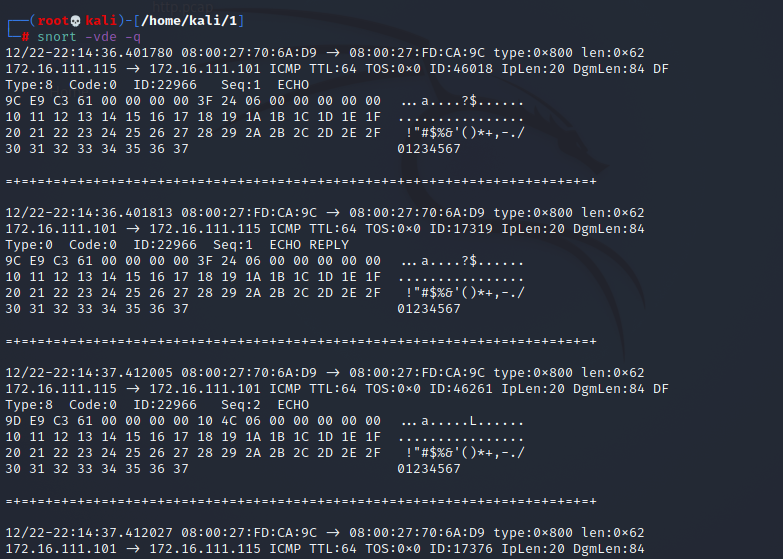
```
-b 参数表示报文存储格式为 tcpdump 格式文件

-q 静默操作，不显示版本欢迎信息和初始化信息
```
`snort -q -v -b -i eth0 "port not 22"`
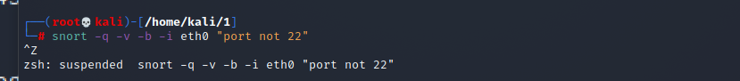

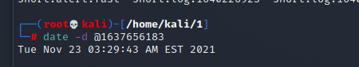

``` 
使用 CTRL-C 退出嗅探模式
嗅探到的数据包会保存在 /var/log/snort/snort.log.<epoch timestamp>
其中<epoch timestamp>为抓包开始时间的UNIX Epoch Time格式串
可以通过命令 date -d @<epoch timestamp> 转换时间为人类可读格式
exampel: date -d @1511870195 转换时间为人类可读格式
上述命令用tshark等价实现如下：
tshark -i eth0 -f "port not 22" -w 1_tshark.pcap
```
### 实验二：配置并启用snort内置规则
/etc/snort/snort.conf 中的 HOME_NET 和 EXTERNAL_NET 需要正确定义,如下
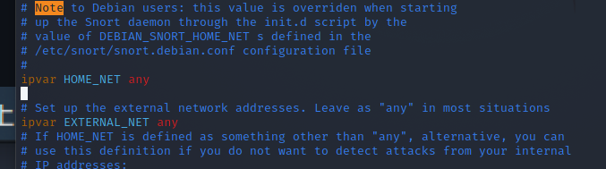
例如，学习实验目的，可以将这两个变量值均设置为 any:HOME_NET 和 EXTERNAL_NET 

启用snort内置规则:`
snort -q -A console -b -i eth0 -c /etc/snort/snort.conf -l /var/log/snort/`
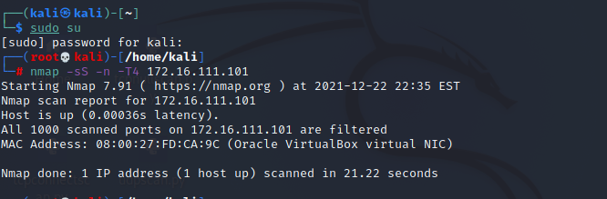
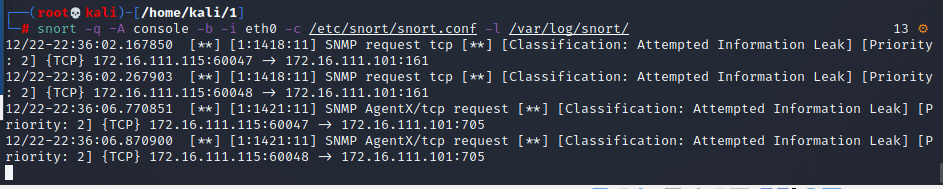

### 实验三：自定义snort规则
```
新建自定义 snort 规则文件
cat << EOF > /etc/snort/rules/cnss.rules
alert tcp \$EXTERNAL_NET any -> \$HTTP_SERVERS 80 (msg:"Access Violation has been detected on /etc/passwd ";flags: A+; content:"/etc/passwd"; nocase;sid:1000001; rev:1;)
alert tcp \$EXTERNAL_NET any -> \$HTTP_SERVERS 80 (msg:"Possible too many connections toward my http server"; threshold:type threshold, track by_src, count 100, seconds 2; classtype:attempted-dos; sid:1000002; rev:1;)
EOF

添加配置代码到 /etc/snort/snort.conf
include $RULE_PATH/cnss.rules

snort -q -A fast -b -i eth0 -c /etc/snort/snort.conf -l /var/log/snort/
```
### 实验四：和防火墙联动
本实验需要用到的脚本代码[Guardian-1.7.tar.gz](https://c4pr1c3.gitee.io/cuc-ns/chap0x09/attach/guardian.tar.gz) ，请下载后解压缩：
```
解压缩 Guardian-1.7.tar.gz
tar zxf guardian.tar.gz

安装 Guardian 的依赖 lib
apt install libperl4-corelibs-perl
```
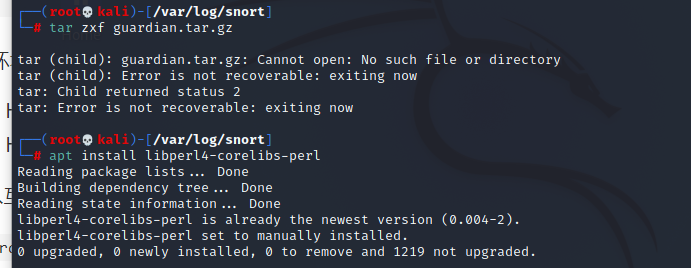
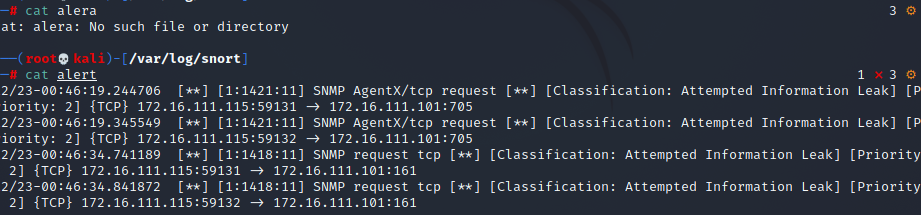
编辑 guardian.conf 并保存，确认以下2个参数的配置符合主机的实际环境参数。
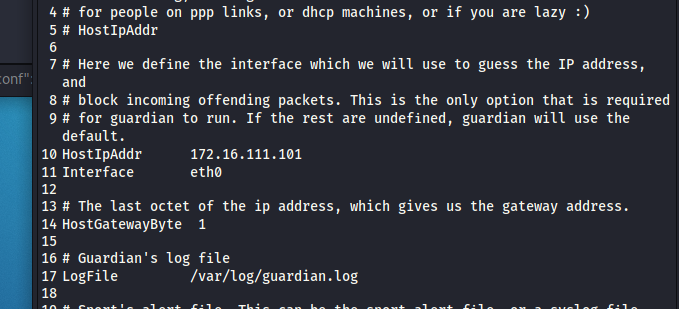

本次实验需要的一个最小化的实验环境是2台主机，网络拓扑信息如下：

attacker IP: 172.16.111.115 eth0 Host-only 运行 nmap 扫描 Victim

Victim IP: 172.16.111.101 eth0 Host-only 运行 snort 和 guardian.pl

开始实验之前，Victim 和 attacker 可以互相双向访问。

在Victim上先后开启 snort 和 guardian.pl

开启 snort
`snort -q -A fast -b -i eth0 -c /etc/snort/snort.conf -l /var/log/snort/`


启动 guardian.pl
`perl guardian.pl -c guardian.conf`:
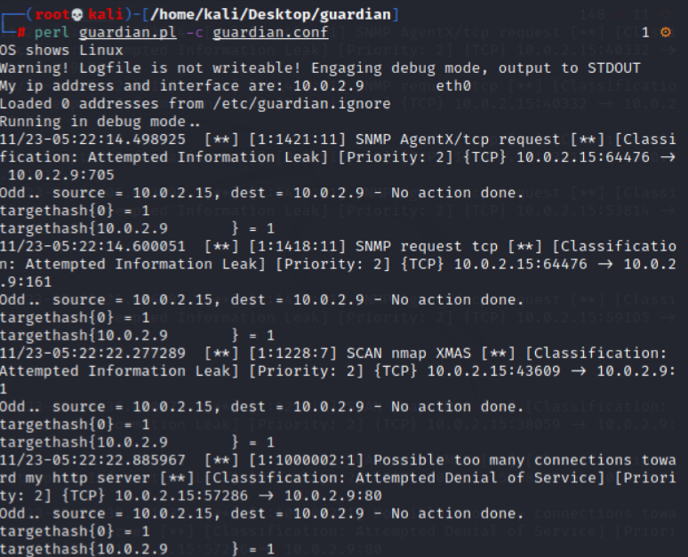

在attacker上用 nmap 暴力扫描 Victim：
`nmap 172.16.111.101 -A -T4 -n -vv`
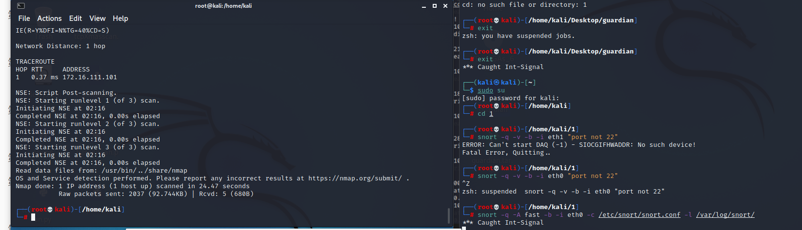
guardian.conf 中默认的来源IP被屏蔽时间是 60 秒（屏蔽期间如果黑名单上的来源IP再次触发snort报警消息，则屏蔽时间会继续累加60秒）

## 实验思考题
IDS与防火墙的联动防御方式相比IPS方式防御存在哪些缺陷？是否存在相比较而言的优势？
```
入侵检测系统 IDS (Intrusion Detection Systems)：分析和监控网络流量，以查找表明攻击者正在使用已知网络威胁来渗透或窃取网络数据的标志。 IDS系统将当前网络活动与已知威胁数据库进行比较，以检测安全策略违规，恶意软件和端口扫描程序等多种行为。

入侵防御系统 IPS (Intrusion Prevention Systems) ：与防火墙位于网络的同一区域。 检查数据包的内容，主动阻止或阻止检测到的入侵。可以采取发送警报等措施，丢弃检测到的恶意数据包，重置连接或阻止来自违规IP地址的流量。还可以纠正循环冗余校验（CRC）错误，对数据包进行碎片整理，缓解TCP排序问题，并清理不需要的传输和网络层选项。

默认情况下，IDS/IPS 以混杂模式运行，这意味着设备捕获流量并将副本转发给 IDS/IPS 进行分析。因为处理的是流量副本，可以检测到攻击并发送警报（并采取其他操作），但不会阻止攻击进入网络或网段。而当 IPS 在内联(in-line)模式下工作时，它是直接工作在实际的流量路径中，可以检测威胁也可以进行防御。

相比而言， IDS 由于是被动检测，因此检测时可以进行更加复杂的分析；而 IPS 必须快速执行其检查和响应的工作，以避免降低网络性能并实时阻止潜在的攻击。

可以将某些 IDS 系统配置为采取预定义的主动操作以响应威胁。一个例子就是修改防火墙的规则以阻止来自特定IP地址的不需要的流量，这被称为响应型IDS。（就比如实验四中的 snort + guardian）
```