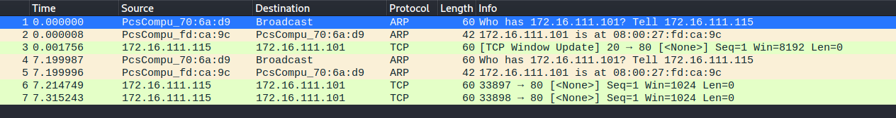

# 实验五 基于Scapy编写端口扫描器
杨林 2019302120111
## 实验目的
掌握网络扫描之端口状态探测的基本原理
## 实验环境
python+scapy
## 实验要求
禁止探测互联网上的 IP ，严格遵守网络安全相关法律法规

完成以下扫描技术的编程实现：
1. TCP connect scan / TCP stealth scan
2. TCP Xmas scan / TCP fin scan / TCP null scan
3. UDP scan

上述每种扫描技术的实现测试均需要测试端口状态为：开放、关闭 和 过滤 状态时的程序执行结果

提供每一次扫描测试的抓包结果并分析与课本中的扫描方法原理是否相符？如果不同，试分析原因；

在实验报告中详细说明实验网络环境拓扑、被测试 IP 的端口状态是如何模拟的

（可选）复刻 nmap 的上述扫描技术实现的命令行参数开关
## 进行实验的过程如下：
1. 已知攻击者主机，受害者主机，网关的ip地址如下图：
 
 
 
 则创建网络拓扑图如下：
 

2. 在受害者主机上安装ufw以控制端口状态
 
 再继续安装dnsmasq以开启udp端口的状态
 

3. 用nmaq检查被扫描主机的状态如下，所有端口均关闭
 

4. 进行TCP connect scan的实验，代码在code文件
   
   * 端口状态：关闭
      
      攻击者主机运行代码并使用nmaq检查时的结果如下
     
     受害者主机抓包的结果为
     
    
    * 端口状态：开启

      攻击者主机运行代码并使用nmaq检查时的结果如下
      
      
       受害者主机抓包的结果为
       
       注意：受害者主机开启端口以及抓包时所进行的操作如下
       
    
    * 端口状态：过滤
  
      攻击者主机运行代码并使用nmaq检查时的结果如下
      
      
      受害者主机抓包的结果为
      
      注意：受害者主机进行端口过滤以及抓包时所进行的操作如下
      

5. 进行TCP stealth scan的实验，代码在code文件
   
   * 端口状态：关闭
      
      攻击者主机运行代码并使用nmaq检查时的结果如下
     
     
     受害者主机抓包的结果为
     
    
    * 端口状态：开启

      攻击者主机运行代码并使用nmaq检查时的结果如下
      
      
       受害者主机抓包的结果为
       
       注意：受害者主机开启端口以及抓包时所进行的操作与前一个实验的要求相同
    
    * 端口状态：过滤
  
      攻击者主机运行代码并使用nmaq检查时的结果如下
      
      
      受害者主机抓包的结果为
      
      注意：受害者主机进行端口过滤以及抓包时所进行的操作也与之前相同

6. 进行TCP Xmas scan的实验，代码在code文件
   
   * 端口状态：关闭
      
      攻击者主机运行代码并使用nmaq检查时的结果如下
     
     
     受害者主机抓包的结果为
     
    
    * 端口状态：开启

      攻击者主机运行代码并使用nmaq检查时的结果如下
      
      
       受害者主机抓包的结果为
       
       注意：开启端口以及抓包时所进行的操作与前一个实验的要求相同
    
    * 端口状态：过滤
  
      攻击者主机运行代码并使用nmaq检查时的结果如下
      
      
      受害者主机抓包的结果为
      
      注意：进行端口过滤以及抓包时所进行的操作也与之前相同

7. 进行TCP fin scan的实验，代码在code文件
   
   * 端口状态：关闭
      
      攻击者主机运行代码并使用nmaq检查时的结果如下
     
     受害者主机抓包的结果为
     
    
    * 端口状态：开启

      攻击者主机运行代码并使用nmaq检查时的结果如下
      
       受害者主机抓包的结果为
       
       注意：开启端口以及抓包时所进行的操作与前一个实验的要求相同
    
    * 端口状态：过滤
  
      攻击者主机运行代码并使用nmaq检查时的结果如下
      
      受害者主机抓包的结果为
      
      注意：进行端口过滤以及抓包时所进行的操作也与之前相同

8. 进行TCP null scan的实验，代码在code文件
   
   * 端口状态：关闭
      
      攻击者主机运行代码并使用nmaq检查时的结果如下
     
     受害者主机抓包的结果为
     
    
    * 端口状态：开启

      攻击者主机运行代码并使用nmaq检查时的结果如下
      
       受害者主机抓包的结果为
       
       注意：开启端口以及抓包时所进行的操作与前一个实验的要求相同
    
    * 端口状态：过滤
  
      攻击者主机运行代码并使用nmaq检查时的结果如下
      
      受害者主机抓包的结果为
      
      注意：进行端口过滤以及抓包时所进行的操作也与之前相同

9. 进行UDP scan的实验，代码在code文件
   
   * 端口状态：关闭
      
      攻击者主机运行代码并使用nmaq检查时的结果如下
     
     
     受害者主机抓包的结果为
     
    
    * 端口状态：开启

      攻击者主机运行代码并使用nmaq检查时的结果如下
      
       受害者主机抓包的结果为
       
       注意：开启端口以及抓包时所进行的操作与前一个实验的要求相同
    
    * 端口状态：过滤
  
      攻击者主机运行代码并使用nmaq检查时的结果如下
      
      受害者主机抓包的结果为
      
      注意：进行端口过滤以及抓包时所进行的操作为
      

提供每一次扫描测试的抓包结果并分析与课本中的扫描方法原理是否相符？如果不同，试分析原因；
原理相同